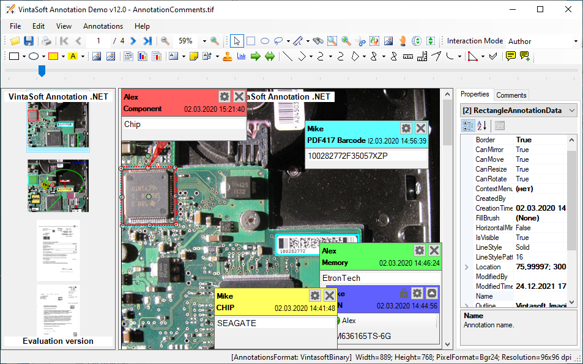

<h1>VintaSoft WinForms Annotation Demo</h1>

Demo application shows how to manipulate annotations: create, process, delete, merge with image, save or load to or from XML, JPEG, TIFF, PNG or PDF file. It contains an implementation of custom-created triangle and mark annotation, as well as AnnotationsToolStrip control. Source codes for C# and VB.NET are available. 
 
Demo uses functionality of <a href="https://www.vintasoft.com/vsimaging-dotnet-index.html">VintaSoft Imaging .NET SDK</a>.

<h2>Screenshot</h2>

<h2>Download</h2>
VintaSoft Imaging .NET SDK distributive package can be downloaded here: https://www.vintasoft.com/download.html

<h2>Documentation</h2>
VintaSoft Imaging .NET SDK on-line User Guide and API Reference is available here: https://www.vintasoft.com/docs/vsimaging-dotnet/

<h2>Support</h2>
Please visit our <a href="https://myaccount.vintasoft.com/">online support center</a> if you have any question or problem.
